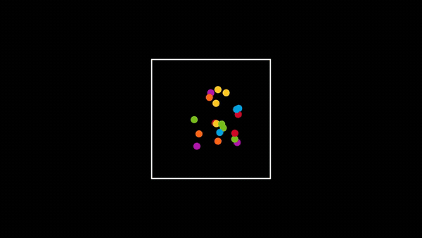
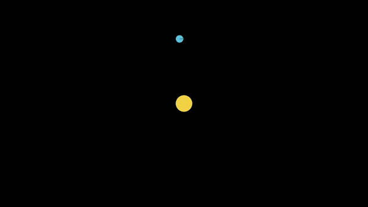
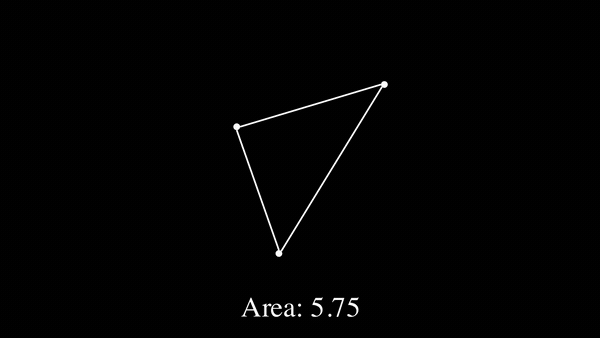

# Manim Simulations

Animations I built while teaching myself [Manim](https://www.manim.community/). Mostly physics simulations, sorting algorithms and geometry.


Made with Manim Community v0.19.1.

## Previews

**Bubble sort by colour**: 10 random colours generated which get sorted by hue.


**Elastic collisions** - 20 balls bouncing off the walls and each other with collision detection. 



**Orbits with a tracking camera** - two planets around a star, with the camera zooming in to follow one of them.



**Triangle area** - the area is recalculated with Heron's formula as the triangle changes shape.



## Files

**collisions/**
- `collision_detection_explained.py` - how you actually detect a collision, building up from the radius to a threshold circle
- `two_ball_collision.py` - two balls in a box, zooming in on the first collision
- `multi_ball_elastic.py` - 20 balls, wall bounces and ball to ball collisions
- `multi_ball_gravity.py` - 10 balls falling, losing speed on each wall bounce

**physics/**
- `two_body_gravity.py` - two bodies pulling on each other
- `orbit_camera_follow.py` - orbits with traced paths and a camera that follows a planet
- `bouncing_ball.py` - a ball dropping and losing 20% of its speed each bounce
- `ball_on_platforms.py` - a ball bouncing across separate platforms

**sorting/**
- `bubble_sort_colours.py` - bubble sort on random colours, compared by hue
- `bubble_sort_grid.py` - the same sort on a grid

**geometry/**
- `triangle_area_heron.py` - live area using Heron's formula
- `midpoint_convergence.py` - repeatedly taking midpoints on a number line

**combinatorics/**
- `table_permutations.py` - seating arrangements around a round table, showing why there are (n-1)! of them

## Running it

```bash
pip install -r requirements.txt
```

You also need FFmpeg installed, plus LaTeX for the scenes with equations in them.

To render a scene, give Manim the file and the class name:

```bash
manim -ql collisions/multi_ball_elastic.py MultiBallElastic
```

`-ql` is a quick low quality preview, `-qh` renders it at 1080p.
